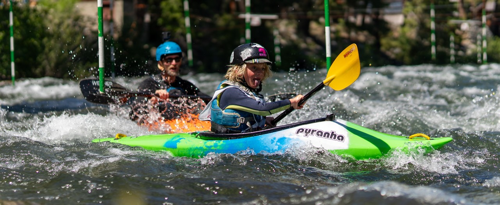
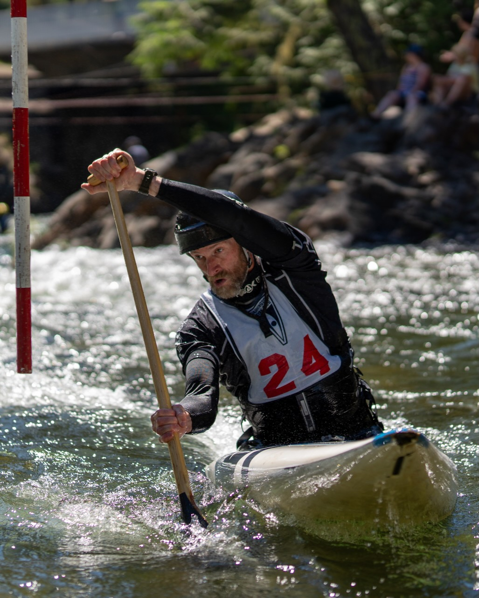

# Excellence through Paddlesport

Whitewater kayaking is visceral. It is powerful, raw, unforgiving and humbling from the very first moment you slide into the current.

## The Learning Curve

> Nothing in this world is worth having or worth doing unless it means effort, pain, difficulty...I have never in my life envied a human being who led an easy life; I have envied a great many people who led difficult lives and led them well. - Theodore Roosevelt

Few sports demand so much, so fast. Few have such a punishingly steep initial learning curve. Sliding into the water for the first time locked into the small narrow craft, every little movement of the water is telegraphed directly into your hips. This intimate connection, it directly communicates the incredible power of the water. This visceral experience is intensified by the very real fear of being upside down, and having to get out of this boat.

This question is not if, but when. Inevitably you will be upside down, typically sooner than later. You will have to get out of this boat while upside down. Hanging upside down completely disoriented with water going up your nose, the water deafeningly loud...in this complete sensory overload, finding the grab loop, pulling the skirt and pushing out of the boat. Breaking the surface feels like being reborn into chaos.

Here in the Pacific Northwest, the water is never warm. The cold water simply sucks energy out of you when you swim. The first few times paddling, it is not if you swim, but how many times. Be terrified, swim, recover, shiver and repeat. It is exhausting.

## _Why?_

{width="50%", align="right"}Why do it? Why pursue this sport? It is for the moments; the moments when you move not against, but with the water. At first they are astonishingly fleeting. Every time in the boat, you are able to find these moments a little more. While fleeting, these moments gradually become more frequent and longer.

These moments are when the water's energy flows up through the hull and into your body. Instead of fighting against, you are gliding _with the water_...going _with the energy_, not against it. The river pulses and surges; you are riding this energy, carving across waves lifting and carrying you. Tapping into the river's rhythm, you are not conquering; it is not mastery, but communion with the energy of the water.

## Excellence

> We are what we repeatedly do. Excellence, therefore, is not an act, but a habit. - Will Durant, 1926

Watch world‑class paddlers and it seems impossible that anything could go wrong. Their strokes are quiet, almost delicate, yet every movement is loaded with intent. When balance, timing, and instinct align, you witness the moments when fleeting glimpses of perfection are visible.

Ask any of these athletes, even the best...there is always more. Perfection is unreachable. But excellence is real, earned by continually sharpening senses, timing, and refining the vision of what perfection might feel like for one brief, electric moment when excellence is realized.

In the early 1900s, the historian and philosopher Will Durant distilled Aristotle’s thinking into a single idea: we become what we repeatedly do. "We are what we repeatedly do. Excellence, therefore, is not an act, but a habit." Excellence isn’t born in a single grand gesture, nor in the occasional burst of effort. It grows slowly, almost imperceptibly, through the rhythm of practice.

Excellence in whitewater is realized by making the river an almost daily habit...coming to the river, getting in the boat, arriving humble, curious and willing to be shaped by the water. Show up, work, learn, and on certain rare days, effort aligns and a fleeting glimpse of excellence is realized...and it is wonderful.

This is why it is important not to do a _lot a little_, but rather to do a _little a lot_. Show up with your whole being and grow a little bit every day. The journey to excellence is guided by perfection one small step at a time.

## The Power of Whitewater

> We choose to...do things, not because they are easy, but because they are hard. - President John Fitzgerald Kennedy

This doing of the thing, this pursuit of excellence...this daily process is a habit of realizing excellence by striving for perfection, it is about learning to show up with confidence, humility and curiosity. It is knowing how to recognize excellence and see past it toward perfection, to recognize this to be able to strive toward it.

These skills are not unique to whitewater paddling. The powerful, raw and unforgiving nature of whitewater however, uniquely hones these skills. It provides a unique environment unlike any other, which can hone the skills for realizing excellence generalizable to any other aspect of life.
